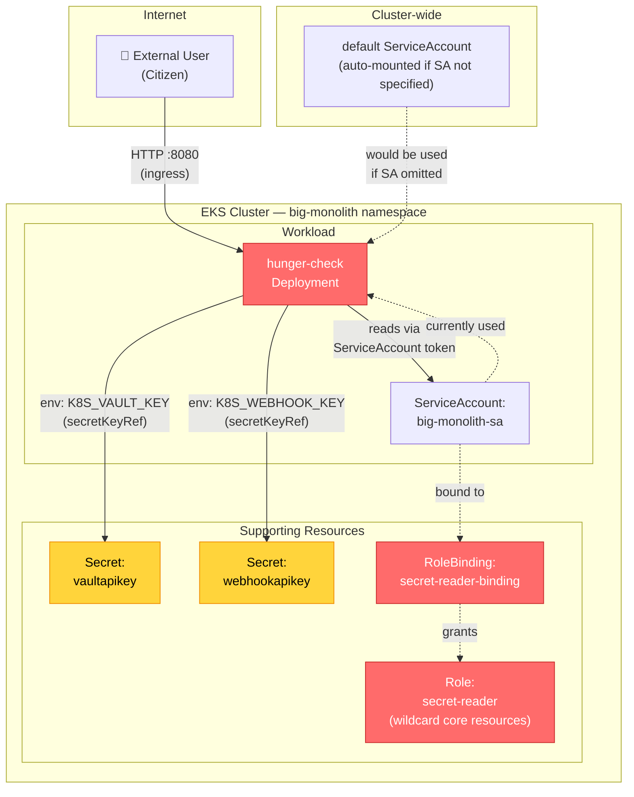

# Threat Model: `hunger-check` Workload

## 1. Methodology

This threat model uses **STRIDE** (Spoofing, Tampering, Repudiation, Information Disclosure, Denial of Service, Elevation of Privilege) as the structured threat classification framework. STRIDE was selected because it provides systematic coverage of threat categories against a data flow model, and its categories map cleanly to Kubernetes-specific attack patterns.

The target workload is **`hunger-check`** from the kubernetes-goat reference repository — a citizen-facing workload in the `big-monolith` namespace that demonstrates several of the programme's real-world security weaknesses.

## 2. Data Flow Diagram

### Data Flow Description

| Flow | Description |
|---|---|
| **External User → hunger-check** | Citizen sends HTTP requests to the hunger-check service via an ingress controller. The traffic is unauthenticated (no mTLS, no JWT validation at this layer). |
| **hunger-check → Secrets** | The container reads two API keys (`vaultapikey`, `webhookapikey`) from environment variables injected via `secretKeyRef`. These keys are committed as base64 in the manifest (K8S-009). |
| **hunger-check → ServiceAccount** | The pod uses `big-monolith-sa`, which is bound to the `secret-reader` Role. This Role grants `get`, `list`, `watch` on **all core API resources** in the namespace (K8S-007). |
| **default SA → hunger-check** | If the deployment is misconfigured and `serviceAccountName` is omitted, the `default` SA is auto-mounted. In the pwnchart scenario (K8S-003), this would grant cluster-admin. Even without pwnchart, the default SA may have unintended token access. |

## 3. STRIDE Threat Analysis

### T1: Spoofing — Attacker impersonates the hunger-check service

| Field | Detail |
|---|---|
| **STRIDE category** | Spoofing |
| **Scenario** | An attacker deploys a rogue pod in the `big-monolith` namespace (or any namespace if no admission controller blocks it — K8S-020) that impersonates the hunger-check service by using the same labels/app name, intercepting traffic from users who trust the service. |
| **Likelihood** | Medium — requires the ability to deploy a pod (no admission controller blocks this — K8S-020). |
| **Impact** | High — citizens could be redirected to a malicious service, leading to credential theft or data exfiltration. |
| **Existing/proposed control** | **Module 2 (Kyverno admission):** Restrict pod image sources to approved registries by digest (K8S-013/014). **Module 4 (Cilium mTLS):** WireGuard-based pod identity prevents impersonation at the network layer. |
| **Residual risk** | Low after controls deployed. Without admission + mTLS, risk is High. |

### T2: Tampering — Attacker modifies hunger-check container image or configuration

| Field | Detail |
|---|---|
| **STRIDE category** | Tampering |
| **Scenario** | An attacker with CI/CD pipeline access pushes a modified image to the registry (supply chain attack). The image is tagged with the same name, and the deployment pulls the new image. Alternatively, an attacker modifies the deployment manifest to inject malicious environment variables or volumes. |
| **Likelihood** | Medium — requires pipeline access or cluster write access. |
| **Impact** | Critical — arbitrary code execution in the context of `big-monolith-sa`, which has broad namespace read access (K8S-007). |
| **Existing/proposed control** | **Module 2 (Cosign signing):** Images must be signed by the programme's KMS key. Kyverno admission rejects unsigned images. **Module 2 (GitLab branch protection):** Manifest changes require MR approval. |
| **Residual risk** | Low after controls deployed. Without image signing, risk is Critical. |

### T3: Repudiation — Attacker accesses secrets without audit trail

| Field | Detail |
|---|---|
| **STRIDE category** | Repudiation |
| **Scenario** | An attacker (or insider) uses the over-broad `secret-reader` Role (K8S-007) to read all Secrets in the `big-monolith` namespace. Because there is no audit logging (K8S-019) and no runtime detection (Module 3 current state), the access leaves no trace. The attacker later denies involvement. |
| **Likelihood** | High — the over-broad Role makes this trivial, and there is no detection capability. |
| **Impact** | High — secret exfiltration without attribution or detection. |
| **Existing/proposed control** | **Module 3 (Falco):** `Kubernetes Secrets Accessed from Unapproved Path` rule detects Secret reads. **Module 3 (K8s Audit Logs):** API server audit logs record all Secret access by service account. |
| **Residual risk** | Medium. Falco detects runtime access but audit log retention and SIEM ingestion must be confirmed. If audit logs are not enabled on the cluster, this is a genuine gap until K8S-019 is remediated. |

### T4: Information Disclosure — Secrets leaked via environment variables and Git history

| Field | Detail |
|---|---|
| **STRIDE category** | Information Disclosure |
| **Scenario** | The `vaultapikey` and `webhookapikey` secrets are committed as base64 in `deployment.yaml` (K8S-009). Anyone with Git repository access can read them. The secrets are also injected as environment variables (K8S-010), which are visible via `kubectl describe pod`, process inspection (`/proc/PID/environ`), and some observability stacks. |
| **Likelihood** | Very High — secrets are in a Git repository readable by any developer with repo access. |
| **Impact** | High — the API keys could grant access to external services (vault, webhook endpoints). |
| **Existing/proposed control** | **Module 5 (ESO):** Secrets moved to cloud Secrets Manager, never in Git. **Module 5 (Projected volume):** Secrets mounted as files, not env vars. **Module 2 (gitleaks):** Pipeline blocks secrets in Git. |
| **Residual risk** | Low after controls deployed. **Without Module 5, this is a confirmed unmitigated gap** — see §4. |

### T5: Denial of Service — hunger-check consumes unbounded resources

| Field | Detail |
|---|---|
| **STRIDE category** | Denial of Service |
| **Scenario** | The `hunger-check` Deployment has no CPU/memory requests or limits (K8S-023). A malicious or buggy request causes the container to consume all available node resources, starving other workloads on the same node. In a citizen-facing context, this could cause a service outage during peak traffic. |
| **Likelihood** | Medium — requires a crafted request or application bug, but citizen-facing workloads receive unauthenticated traffic. |
| **Impact** | Medium — service degradation for citizens using the `big-monolith` namespace workloads. |
| **Existing/proposed control** | **Module 6 (K8S-023 fix):** Add resource requests/limits to the deployment. **Module 4 (NetworkPolicy):** Rate limiting at ingress layer. **Kubernetes LimitRange/ResourceQuota** per namespace as platform-level guardrails. |
| **Residual risk** | Low after limits are applied. Without limits, risk is Medium and recurring. |

### T6: Elevation of Privilege — Compromised hunger-check reads all namespace Secrets

| Field | Detail |
|---|---|
| **STRIDE category** | Elevation of Privilege |
| **Scenario** | An attacker exploits a vulnerability in the hunger-check application (e.g. SSRF, command injection) to execute code inside the container. The container uses `big-monolith-sa`, which is bound to the `secret-reader` Role (K8S-007). This Role grants `get`, `list`, `watch` on **all core API resources** in the namespace — including all Secrets. The attacker reads every Secret in `big-monolith`, including `vaultapikey` and `webhookapikey`. |
| **Likelihood** | High — the application has no security context (K8S-021), runs as image default (likely root), and has broad RBAC permissions. Exploitation of a web application vulnerability is a realistic attack path. |
| **Impact** | Critical — full namespace Secret exposure, potential lateral movement if other workloads share secrets. |
| **Existing/proposed control** | **Module 6 (K8S-007/008 fix):** Narrow the `secret-reader` Role to only specific Secret names. **Module 1/2 (Conftest policy):** Block wildcard `resources` in Roles. **Module 4 (NetworkPolicy):** Isolate the namespace to limit lateral movement. |
| **Residual risk** | Low after RBAC is narrowed. Without the fix, risk is Critical — this is the most directly exploitable finding in this workload. |

### T7: Spoofing — CI job uses stolen ServiceAccount token to access cluster

| Field | Detail |
|---|---|
| **STRIDE category** | Spoofing |
| **Scenario** | An attacker compromises the CI/CD pipeline (e.g. via a poisoned dependency or stolen GitLab runner token) and gains access to a Kubernetes ServiceAccount token. If the CI job's SA has cluster-admin (the trigger incident — K8S-001), the attacker can access every workload including hunger-check's secrets. |
| **Likelihood** | Medium — requires CI pipeline compromise, but supply chain attacks are increasingly common. |
| **Impact** | Critical — cluster-wide compromise via the trigger incident pattern. |
| **Existing/proposed control** | **Module 1 (K8S-001 fix):** Delete the cluster-admin binding. **Module 2 (Pipeline):** gitleaks + Conftest RBAC policies block overly permissive SA bindings in manifests. **Module 5 (IRSA):** CI jobs use scoped IAM roles, not cluster-admin. |
| **Residual risk** | Low after K8S-001 is remediated. This is the trigger incident — the highest-priority fix. |

### T8: Information Disclosure — Pod logs and crash dumps expose secrets in environment

| Field | Detail |
|---|---|
| **STRIDE category** | Information Disclosure |
| **Scenario** | The hunger-check container receives secrets as environment variables (K8S-010). If the application logs environment variables on startup (a common debug pattern), or if the pod crashes and a core dump is collected, the secret values (`K8S_VAULT_KEY`, `K8S_WEBHOOK_KEY`) appear in plaintext in logs and crash dumps. These logs may be collected by a centralised logging stack and retained for months. |
| **Likelihood** | High — many applications log configuration on startup for debugging. Crash dumps are collected by default on many platforms. |
| **Impact** | Medium — the secrets are API keys, not user PII, but they could grant access to external services. |
| **Existing/proposed control** | **Module 5 (Projected volume):** Secrets mounted as files, not env vars — they do not appear in process listings or core dumps. **Application-level:** Developers should never log secrets; this is a code review concern. |
| **Residual risk** | Low after Module 5 is deployed. Without the fix, risk is Medium and dependent on application behaviour. |

### T9: Elevation of Privilege — Default ServiceAccount auto-mount grants unintended API access

| Field | Detail |
|---|---|
| **STRIDE category** | Elevation of Privilege |
| **Scenario** | If the `hunger-check` deployment is redeployed without `serviceAccountName` specified, Kubernetes auto-mounts the `default` ServiceAccount. In the current estate, the default SA may have a token that can reach the API server. If the pwnchart ClusterRoleBinding (K8S-003) is active, this grants cluster-admin. Even without pwnchart, the auto-mounted token provides API access that the workload never needed. |
| **Likelihood** | Medium — requires a deployment misconfiguration (omitting `serviceAccountName`), which is realistic in a 100-workload estate without admission controls. |
| **Impact** | Critical (if K8S-003 active) / Medium (if only default SA token exposed) |
| **Existing/proposed control** | **Module 2 (Kyverno policy):** Block pods without explicit `serviceAccountName`. **Module 1 (K8S-003 fix):** Delete the pwnchart ClusterRoleBinding. **Platform:** Set `automountServiceAccountToken: false` on all default SAs. |
| **Residual risk** | Low after admission policy and K8S-003 fix. Without them, risk is Critical. |

## 4. Residual Risk: Unmitigated Threat

**Threat T4 (Information Disclosure — Secrets in Git and environment variables) is NOT fully mitigated until Module 5 (ESO + Cloud Secrets Manager) is deployed.**

Currently:
- Secrets are committed as base64 in Git (K8S-009) — anyone with repo access can read them
- Secrets are injected as environment variables (K8S-010) — visible via process inspection
- The Git history retains old secret values even if the manifest is updated — rotating the secret does not remove it from history

**Module 2 (gitleaks)** prevents _new_ secrets from being committed, but does not remove secrets already in Git history. **Module 5 (ESO)** moves secrets out of manifests entirely, but requires cloud Secrets Manager infrastructure and IRSA setup that takes 1-2 weeks to implement.

**Residual risk statement:** Until Module 5 is deployed, the `vaultapikey` and `webhookapikey` values are accessible to anyone with Git repository read access. This is a **Medium** residual risk (information disclosure of API keys, not user PII, but with potential for service impersonation). The risk is accepted with the understanding that Module 5 is a priority deliverable before governance sign-off, and the secrets will be rotated immediately upon Module 5 deployment.

**Mitigation while Module 5 is pending:**
1. Rotate both API keys immediately (generate new values in the external service)
2. Remove the old secret values from Git history using `git filter-repo` or BFG Repo-Cleaner
3. Restrict Git repository access to the minimum necessary team members
4. Enable GitLab audit events for repository read access

## 5. Summary

| STRIDE Category | Threats Found | Highest Severity | Key Control |
|---|---|---|---|
| Spoofing | T1, T7 | Critical (T7) | K8S-001 fix + IRSA + Kyverno admission |
| Tampering | T2 | Critical | Cosign signing + GitLab branch protection |
| Repudiation | T3 | High | Falco + K8s Audit Logs |
| Information Disclosure | T4, T8 | Very High (T4) | ESO (Module 5) — **pending** |
| Denial of Service | T5 | Medium | Resource limits + LimitRange |
| Elevation of Privilege | T6, T9 | Critical (T6) | RBAC narrowing (K8S-007/008 fix) |

**Total threats identified:** 9 across all 6 STRIDE categories.
**Fully mitigated (after all modules deployed):** 8 of 9.
**Partially mitigated (pending Module 5):** 1 (T4 — Information Disclosure).
