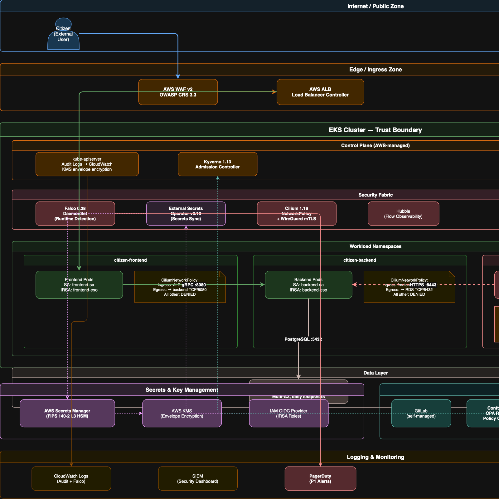
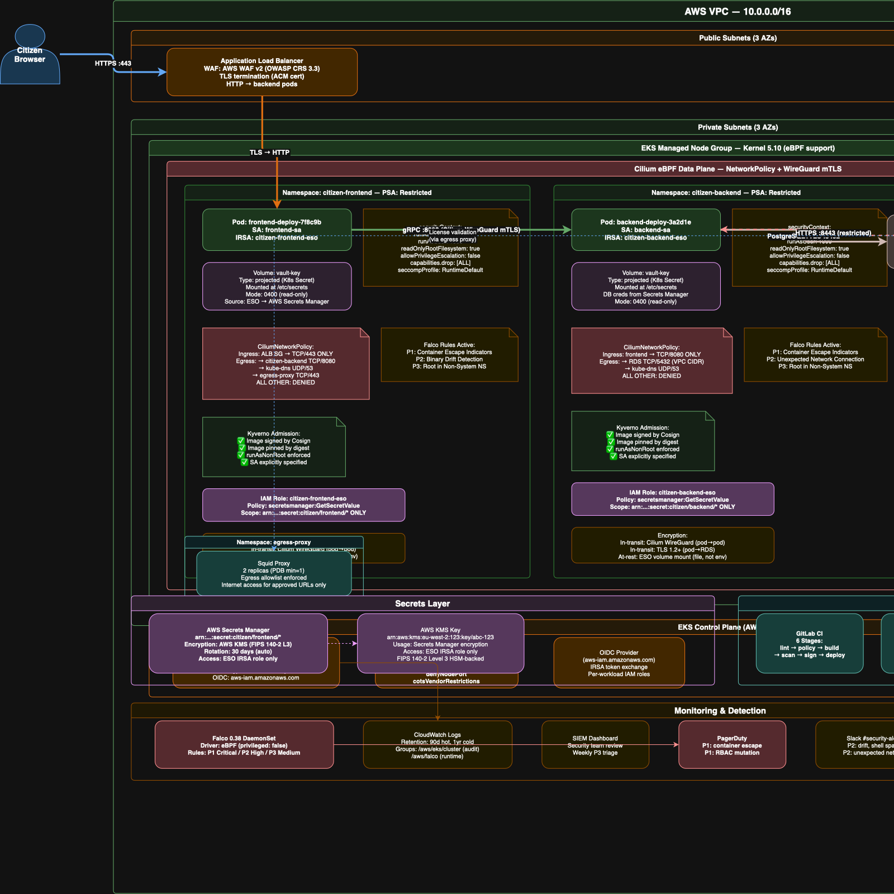

# DevSecOps Assessment — Track 1
## Kubernetes Estate Security Review & Target-State Design

Programme: Multi-cloud government programme (~100 workloads, ~18 on EKS)
Scope: Cluster security, supply chain, runtime detection, networking, secrets, remediation
Reference target: kubernetes-goat
Date: July 2026

---

# Agenda

- Findings and risk posture
- Shift-left pipeline and policy gating
- Runtime detection and incident response
- Zero-trust network design
- Secrets and key management
- Remediation and compensating controls
- Threat model and compliance mapping
- Resilience and DR
- Architecture and request flow
- 30/60/90-day plan and panel decision

---

# Executive Summary

- The assessed cluster estate has a **High** risk posture with **6 Critical** and **12 High** findings.
- The most critical issue is **K8S-001**: a non-system ServiceAccount bound to `cluster-admin`.
- The solution combines shift-left CI, runtime detection, zero-trust networking, secrets management, and remediation.
- A professional presentation-ready delivery includes the policy gate, remediation manifests, and evidence artifacts.

---

# Top Findings and Prioritisation

| Finding | Description | Impact |
|---|---|---|
| K8S-001 | `cluster-admin` binding to CI/service account | Cluster-wide compromise |
| K8S-002 / K8S-003 | Wildcard ClusterRole + default SA binding | Any pod can become cluster-admin |
| K8S-004 | Privileged container with host root mount | Node compromise and escape |
| K8S-005 / K8S-006 | Runtime socket mounts and hostNetwork DaemonSet | Fleet-wide blast radius |
| K8S-009 / K8S-010 | Secrets stored in manifests and env vars | Secret disclosure and exfiltration |
| K8S-015 | No NetworkPolicy enforcement | Unrestricted lateral movement |

---

# Findings Summary

- 28 findings total across the assessment.
- 6 Critical findings in RBAC, pod security, and node hardening.
- 12 High findings in secrets, images, network exposure, and logging.
- Key remediation focus is on least privilege and policy enforcement.

---

# Pipeline & Supply Chain Summary

- Six-stage pipeline design:
  1. Lint and validate.
  2. Policy and security gates.
  3. Build and scan.
  4. Sign and attest.
  5. Staging deploy.
  6. Production deploy with manual approval.
- Custom OPA Rego policies detect cluster-admin, wildcard RBAC, privileged pods, and secrets.
- Trivy, Grype, and gitleaks catch vulnerabilities and secrets.
- Cosign signs images and attests SBOM and provenance.

---

# Shift-Left Policy Gate

- Conftest blocks Critical RBAC and pod security violations.
- Hard-fail on Critical and High findings.
- Soft-fail on hygiene issues while the platform baseline is established.
- Kyverno admission verifies the same controls at deploy time.

---

# Runtime Detection Summary

- Selected Falco 0.38.x for runtime security detection.
- Priority alert categories:
  - P1 Critical: RBAC mutation, privileged pod start, escape indicators.
  - P2 High: shell spawn, binary drift, unexpected network connection.
  - P3 Medium: missing seccomp, root container in non-system namespaces.
- Alert routing: PagerDuty for P1, Slack for P2, SIEM for P3.

---

# Incident Response Overview

- Detect and triage P1 alerts immediately.
- Contain by cordoning the node and isolating the pod.
- Capture forensic evidence before terminating the workload.
- Replace the workload with clean signed images and verify controls.

---

# Zero-Trust Networking Summary

- Replace AWS VPC CNI with Cilium 1.16.x for true NetworkPolicy enforcement.
- Use default-deny ingress and egress per namespace.
- Implement explicit flow rules for approved services.
- Block NodePort exposures with admission policy.
- Use an egress proxy for approved internet-bound traffic.

---

# Network Control Rationale

- Cilium provides mTLS, observability, and policy enforcement without sidecars.
- A full service mesh is not appropriate for 18 workloads due to overhead.
- The same Cilium design works across EKS, AKS, and GKE.

---

# Secrets and Key Management Summary

- External Secrets Operator is the selected solution.
- Cloud Secrets Manager is the source of truth.
- Workloads use IRSA or cloud workload identity to fetch their own secrets.
- Secrets are mounted as files, not environment variables.
- Secrets are never stored in Git.

---

# Secrets Architecture Diagram

---

# Secrets & Identity Controls

- Path-scoped IAM roles restrict secret access.
- Projected volumes reduce exposure in process environments.
- Automatic rotation is supported by cloud provider rotation and ESO polling.
- This addresses K8S-009, K8S-010, K8S-011, and K8S-012.

---

# Remediation Summary

- Remove the `superadmin` ClusterRoleBinding and replace with least-privilege roles.
- Delete wildcard ClusterRoles and default SA cluster-admin bindings.
- Harden or remove privileged host-level workloads.
- Apply compensating controls for vendor-constrained COTS images.

---

# Remediation Guidance

- K8S-001: Delete cluster-admin binding and verify with `kubectl auth can-i`.
- K8S-002 / K8S-003: Remove the `pwnchart` wildcard RBAC chart.
- K8S-004: Replace privileged host monitor workloads with managed tooling or hardened context.

---

# COTS Compensating Controls

- Dedicated Cilium network policy for the vendor namespace.
- Falco rules specific to COTS containment.
- Kyverno admission restrictions on RBAC and image digest.
- Weekly Trivy scans with auto-ticketing for new Critical CVEs.

---

# Threat Model Summary

- Used STRIDE to evaluate the `hunger-check` workload.
- Key threats include CI token compromise, over-broad RBAC, secret disclosure, and default SA risk.
- The model shows how controls disrupt attacker paths.
- Residual risk is managed through controls and documented acceptance.

---

# Compliance Summary

- Mapped findings to Access Control, Encryption, Logging, Configuration Baseline, and Secure Development Lifecycle.
- Demonstrated evidence requirements for remediation and exceptions.
- Showed how control evidence supports audit and governance.

---

# Resilience and Disaster Recovery

- Backup the cluster state and volumes with Velero.
- Use RDS automated snapshots for stateful databases.
- Conduct quarterly restore drills.
- Maintain cross-region backups and immutable backup storage.
- Target RPO 24 hours and RTO 4 hours.

---

# Architecture Narrative

- Defence-in-depth with WAF, admission control, zero-trust network, and runtime detection.
- Secrets flow from cloud-managed store to pod volume.
- Images are signed, and admission verifies provenance.
- The COTS workload is isolated with dedicated identity and network policy.

---

# Request Flow Diagram

---

# 30/60/90-Day Plan

- First 30 days: fix Critical RBAC, deploy Falco audit mode, deploy Kyverno audit mode, rotate committed secrets, start Cilium evaluation.
- Days 31-60: enable Falco alert routing, migrate Cilium in staging, deploy ESO for first workloads, enforce Conftest policies, harden privileged workloads.
- Days 61-90: enforce NetworkPolicy in production, validate compensating controls, complete restore drill, assemble compliance evidence, request formal sign-off.

---

# Decision for the Panel

- Seek approval for the 30/60/90-day delivery plan.
- Request conditional acceptance of Medium residual risk for the vendor COTS image.
- Commit to the compensating controls and review expiry within 6 months.
- Continue migration with the proposed secure architecture and policy gates.

---

# Closing Summary

- The solution is complete with findings, CI policy, runtime detection, network enforcement, secrets management, remediation, threat modeling, compliance mapping, DR, and architectural design.
- The deck presents the full professional solution built in this repo.
- The next step is to execute the plan and use the panel decision to move into implementation.
