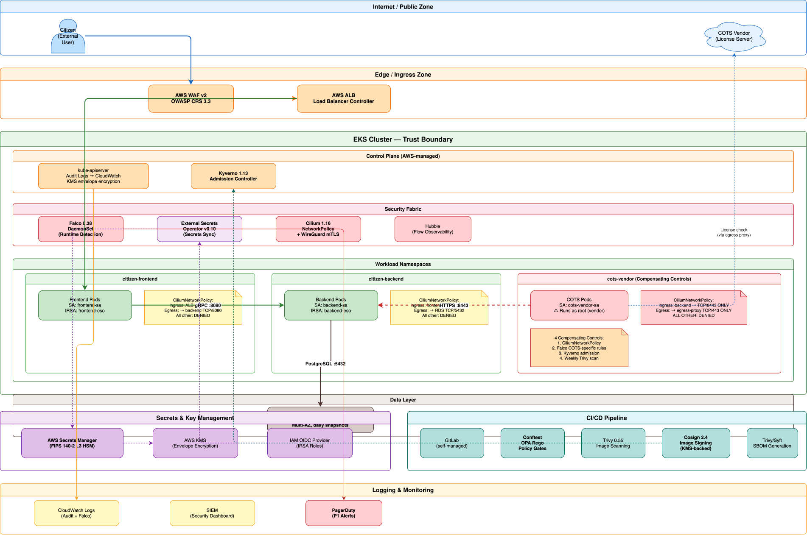

# DevSecOps Assessment — Track 1
## Kubernetes Estate Security Review & Target-State Design

**Programme:** Multi-cloud government programme (~100 workloads, ~18 on EKS)
**Scope:** Cluster security, supply chain, runtime detection, networking, secrets, remediation
**Reference target:** kubernetes-goat (intentionally vulnerable training cluster)
**Date:** July 2026

---

# Executive Summary

## Overall Risk Posture: **High — Remediable Before Go-Live**

The cluster estate has **6 Critical** and **12 High** security findings. The most severe — a `ClusterRoleBinding` granting `cluster-admin` to a CI job's ServiceAccount — mirrors the trigger incident exactly and could enable full cluster compromise.

**What's fixable before the migration wave:**
- All 6 Critical findings (RBAC, pod security) — **2-3 weeks of focused work**
- 8 of 12 High findings (secrets, images, admission) — **part of platform rollout**

**What's accepted as residual risk:**
- COTS vendor image with unpatched CVEs — compensating controls reduce to Medium
- Full NetworkPolicy rollout — requires Cilium CNI migration (6-week phased plan)

---

# Top Findings: Why These Were Prioritised

| ID | Finding | Why Critical/High |
|---|---|---|
| **K8S-001** | `cluster-admin` binding to CI SA | **Direct trigger incident pattern.** Cluster-wide compromise. |
| **K8S-002/003** | Wildcard ClusterRole + default SA binding | Any pod in default namespace inherits cluster-admin. |
| **K8S-004** | Privileged container with host root R/W | Node compromise on every scheduled node. |
| **K8S-005/006** | Container runtime socket + DaemonSet hostNetwork | Container escape + fleet-wide blast radius. |
| **K8S-009/010** | Secrets in manifests + env vars | All secrets readable by any Git reader or pod exec. |
| **K8S-015** | No NetworkPolicy anywhere | Unrestricted lateral movement across 18 workloads. |

---

# The Connected Security Story

## How Modules 2, 3, and 4 Reinforce Each Other

```
Module 2 (Pipeline)     Module 3 (Runtime)      Module 4 (Network)
┌─────────────────┐    ┌─────────────────┐    ┌─────────────────┐
│ Conftest blocks │    │ Falco detects   │    │ Cilium blocks   │
│ K8S-001 in MR   │───▶│ K8S-001 at      │───▶│ lateral movement│
│ (before merge)  │    │ runtime         │    │ after compromise│
│                 │    │ (after deploy)  │    │ (at runtime)    │
└─────────────────┘    └─────────────────┘    └─────────────────┘
        │                      │                      │
        ▼                      ▼                      ▼
   Pipeline fails         PagerDuty P1         Default-deny
   → fix before merge     → incident response   → blast radius = 1 NS
```

**Defence in depth:** A control that fails at one layer is caught at the next. No single layer is trusted alone.

---

# Module 2: Shift-Left Pipeline

## 6-Stage GitLab CI/CD Pipeline

| Stage | Key Tool | What It Catches |
|---|---|---|
| Lint & Validate | yamllint, helm lint, terraform validate | Broken manifests |
| **Policy & Security** | **Conftest (OPA Rego)** | **K8S-001/002/003 RBAC, K8S-004/005/006 pod security** |
| Build & Scan | Trivy + Grype + gitleaks | CVEs, secrets in Git |
| Sign & Attest | Cosign 2.4 + SBOM | Image provenance, SLSA L2 |
| Staging Deploy | Helm + smoke tests | Integration validation |
| **Production Deploy** | **Manual approval gate** | **Security sign-off** |

**Hard-fail on Critical/High findings. Soft-fail on Medium (warn-only).**
Every Module 1 finding is mapped to a specific pipeline gate.

---

# Module 3: Runtime Detection

## Falco 0.38.x — From Zero to Detection in 30 Days

| Priority | Examples | Alert routing |
|---|---|---|
| **P1 Critical** | RBAC mutation, container escape, privileged pod | PagerDuty → immediate |
| **P2 High** | Shell spawn, drift, unexpected network | Slack → 1-hour SLA |
| **P3 Medium** | Root in non-system ns, missing seccomp | SIEM → weekly review |

**Concrete incident scenario:** Container escape on `citizen-frontend` — Falco P1 fires → cordon node → NetworkPolicy isolate pod → forensic capture via SSM (not kubectl exec) → pod kill → clean deploy from signed image. Full response in <2 hours.

---

# Module 4: Zero-Trust Networking

## Cilium 1.16.x Replacing AWS VPC CNI

**Decision: Cilium, not Istio.** At 18 workloads, Istio's sidecar overhead (50MB/pod, 2ms latency) is disproportionate. Cilium provides equivalent mTLS (WireGuard), NetworkPolicy enforcement, and Hubble observability without sidecars.

| Control | What it does |
|---|---|
| Default-deny NetworkPolicy | All traffic blocked unless explicitly allowed |
| Per-namespace egress policies | Workloads can only reach approved destinations |
| Egress proxy | Internet-bound traffic through allowlisted proxy |
| NodePort ban (Kyverno) | K8S-016 remediated at admission |

**Multi-cloud:** Cilium is native on AKS (Azure CNI Powered by Cilium) and GKE (Dataplane V2). Same policies, same rules.

---

# Module 5: Secrets Architecture

## External Secrets Operator + Cloud Secrets Manager

```
AWS Secrets Manager → ESO (1h poll) → K8s Secret → Projected Volume → Pod
```

**Why ESO over Vault:**
- Multi-cloud portability (same CRD on AWS/Azure/GCP)
- Lower operational complexity (no HA storage, no unsealing)
- Cloud KMS root of trust (FIPS 140-2 L3)

**Rotation:** Cloud auto-rotation → ESO detects → K8s Secret updates → Stakater Reloader triggers rolling restart. Zero downtime.

**Key hierarchy:** Cloud KMS (HSM) → envelope encryption → IRSA role (path-based IAM) → workload reads only its own secrets.

---

# Module 6: Remediation — Top 3 Critical

## Delivery-Facing Guidance for Engineers

### K8S-001: Cluster-Admin Binding
- **Delete** the `superadmin` ClusterRoleBinding
- **Create** namespace-scoped Role with least-privilege verbs/resources
- **Evidence:** `kubectl auth can-i --list` shows no cluster access

### K8S-002/003: Wildcard ClusterRole + Default SA
- **Delete** `all-your-base` ClusterRole and `belong-to-us` binding
- **Remove** `pwnchart` Helm chart from deployable paths
- **Evidence:** Conftest policy test blocks re-deployment

### K8S-004: Privileged Container + Host Root Mount
- **Replace** with managed tooling (CloudWatch Agent, Falco)
- **OR** harden security context: no privileged, no hostPath, runAsNonRoot
- **Evidence:** Fixed manifests in `06-remediation/fixed-manifests/`

---

# Module 7: COTS Compensating Controls

## Accepted Risk: Unpatched Vendor Image + Root Execution

**Four compensating controls:**

| # | Control | Module source |
|---|---|---|
| 1 | Cilium NetworkPolicy: dedicated namespace, default-deny, single ingress source | Module 4 |
| 2 | Falco: COTS-specific rules (shell spawn, shadow read, unexpected network) | Module 3 |
| 3 | Kyverno: blocks RBAC modification, restricts to designated namespace, image by digest | Module 2/5 |
| 4 | Weekly Trivy scan with auto-ticketing on new Critical CVE | Module 2 |

**Residual risk: Medium** (down from Critical)
**Accepted by:** ITSO-equivalent / Accreditor
**Expiry:** 6 months or vendor patch, whichever is earlier

---

# HLD: System Context



*Defence-in-depth: WAF → Kyverno → Cilium → Falco. Each layer independent.*

---

# LLD: Request Path — Frontend → Backend → Data


| Step | Control | Detail |
|---|---|---|
| Citizen → ALB | WAF v2 + TLS termination | OWASP CRS 3.3, HTTPS :443 |
| ALB → Frontend | Cilium Ingress Policy | ALB SG → TCP/443 only |
| Frontend Pod | Security Context | runAsNonRoot, readOnlyRootFS, drop ALL caps |
| Frontend → Backend | Cilium Egress + WireGuard mTLS | TCP/8080 gRPC, encrypted in-transit |
| Backend → RDS | NetworkPolicy + TLS | VPC CIDR TCP/5432, RDS enforced SSL |
| Secrets | ESO → IRSA → volume mount | Never in Git, never in env vars |
| Admission | Kyverno verifyImages | Cosign signature + digest pin |

---

# 30/60/90-Day Plan

## First 30 Days: Critical Fixes + Foundation
- Delete K8S-001/002/003 (cluster-admin bindings) — **day 1**
- Deploy Falco DaemonSet in audit-only mode
- Deploy Kyverno admission controller (audit mode)
- Rotate all committed secrets (K8S-009)
- Begin Cilium CNI evaluation in staging

## Days 31-60: Platform Rollout
- Enable Falco P1/P2 alert routing (after baseline tuning)
- Cilium CNI migration on production (one namespace at a time)
- ESO + Secrets Manager integration for first 3 workloads
- Conftest policies live in CI pipeline (hard-fail on Critical/High)
- Fix K8S-004/005/006 pod security

## Days 61-90: Governance Sign-Off
- Full NetworkPolicy enforcement on all production namespaces
- COTS compensating controls verified operational
- Quarterly DR restore drill completed
- Compliance evidence package assembled for ITSO review
- **Formal governance sign-off requested**

---

# The Decision We're Asking the Panel

## COTS Vendor Image: Accepted Residual Risk

The programme requests formal acceptance of **Medium residual risk** for one COTS vendor image with:
- Known unpatched Critical CVEs (base image)
- Root execution (vendor requirement)

**In exchange, the programme commits to:**
- Four compensating controls operational before go-live
- Weekly vulnerability scan with 30-day vendor response SLA
- 6-month expiry with mandatory re-evaluation
- Alternative product evaluation initiated immediately

**Acceptance authority:** ITSO-equivalent / Accreditor

---

# Summary

| Deliverable | Status |
|---|---|
| Findings Register (28 findings) | ✅ Complete |
| Pipeline & Supply Chain (6-stage) | ✅ Complete |
| Runtime Detection (Falco + IR) | ✅ Complete |
| Zero-Trust Networking (Cilium) | ✅ Complete |
| Secrets Architecture (ESO) | ✅ Complete |
| Remediation Pack (top 3 Critical) | ✅ Complete |
| Compensating Controls (COTS) | ✅ Complete |
| Threat Model (STRIDE, 9 threats) | ✅ Complete |
| Compliance Mapping (5 findings × 5 domains) | ✅ Complete |
| Architecture (HLD + LLD Mermaid) | ✅ Complete |
| Resilience & DR (Velero, RTO/RPO) | ✅ Complete |
| Presentation (this deck) | ✅ Complete |

**Recommendation:** Approve the 30/60/90-day plan and COTS risk acceptance to proceed with the migration wave.
